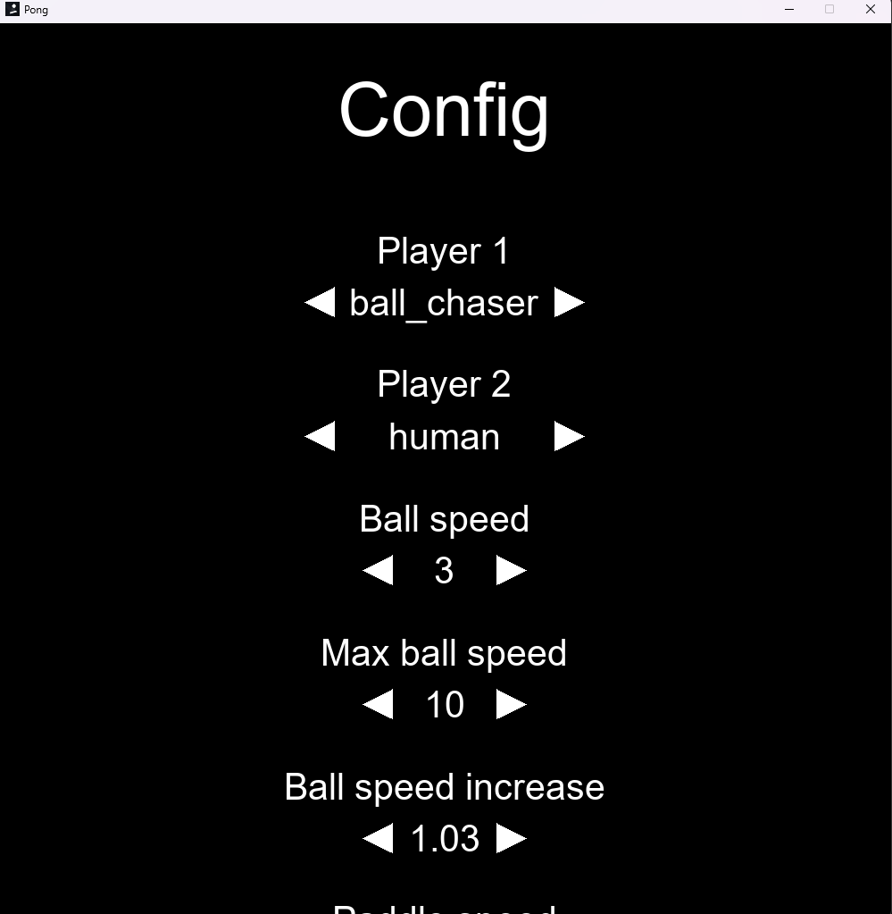

# Pong NEAT-RL

Pong NEAT-RL est une implémentation du jeu classique Pong avec un algorithme NEAT (NeuroEvolution of Augmenting Topologies) pour l'apprentissage par renforcement. Les joueurs peuvent s'affronter contre une IA qui s'est améliorée au fil du temps grâce à l'apprentissage par renforcement. Un autre algorithme est disponible, l'algorithme basique de poursuite de balle (ball chasing) qui se contente de suivre la balle. Un menu de configuration est disponible pour choisir les différents paramètres liés aux algorithmes et au jeu.

Le jeu inclut également un mode avec des items qui apparaissent aléatoirement durant la partie. Ces items permettent de rétrécir ou d'agrandir les barres des joueurs, ajoutant ainsi un élément supplémentaire de stratégie et de défi.

## Différents apperçus du jeu




## Installation

Ce projet a été réalisé avec Python 3.10.0. Il est recommandé d'utiliser un environnement virtuel pour installer les dépendances.

1. Cloner le projet et accéder au répertoire :


```bash
- git clone https://github.com/hugo-hamon/ReinforcementPong.git
- cd ReinforcementPong
```

2. Créez un environnement virtuel et l'activer :
    
- Sous linux et macOS :
```bash
python3 -m venv venv
source venv/bin/activate
```
- Sous Windows :
```bash
python3 -m venv venv
.\venv\Scripts\activate
```

3. Installez les dépendances nécessaires à l'aide de `requirements.txt` :
```bash
pip install -r requirements.txt
```

## Exécution du projet

Exécutez le fichier `run.py` dans le dossier `project` :
```bash
cd project
python run.py
```

Vous pouvez naviguer dans le menu pour configurer le jeu, puis lancer une partie contre l'IA.

## Licence
Ce projet est sous licence [MIT License](LICENSE).
